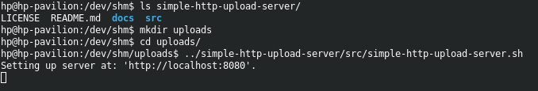
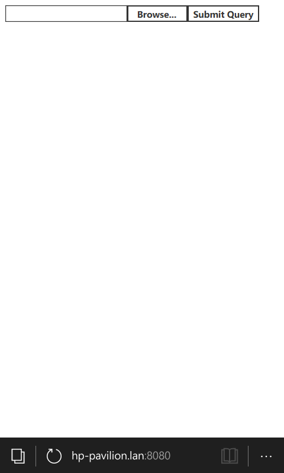
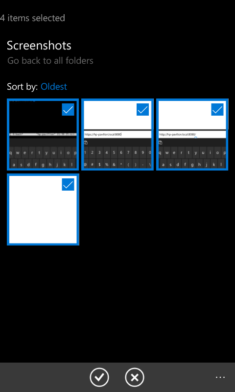
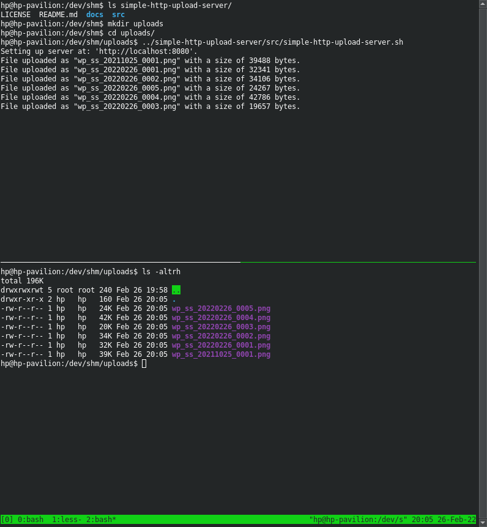

# simple-http-upload-server
Simple HTTP File Upload server with few dependencies.

# Overview
The purpose of this project is to provide a quick and easy way to transfer files from some device with a web browser to a Linux machine.
The goal is to do with without depending on any other server software (hence, the "simple" part of the name). Though, there are still some dependencies (but these are included in Ubuntu by default).

# Dependencies
 - awk (Should be installed by default on Ubuntu).
 - netcat (Open BSD version - should also be installed by default on Ubuntu).


# Installation and Use

1. Clone this repo to your system:
   ```
   git clone https://github.com/i3Craig/simple-http-upload-server.git
   ```

2. Create an empty directory (where the uploaded files will be saved to):
   ```
   mkdir uploads;
   cd uploads
   ```

3. Run the server script in this upload directory (The path may need to be adjusted to where you cloned the repo):
   ```
   ../simple-http-upload-server/src/simple-http-upload-server.sh
   ```

4. Open the webpage on the device which will be sending the file(s).
   Go to `http://HOSTNAME.local:8080` where `YOURHOSTNAME` is the name of your system (find with `hostname` in a terminal).
   If that fails, an IP address can be used instead.

5. Select the files to send to the server.

6. Press the `submit` button.

7. The files uploaded will show in the output from the server script and the files should now be in the specified upload directory.

# Screenshots
After starting up the server, the output should show that the server is now running (with no erros).

   

After navigating to the hosted webpage, only a file browser control and submit button should be visible. Select the file browse control to select files. Note that I had to navigate to `hp-pavilion.lan:8080` because Windows 10 Mobile does not seem to like the `.local` notation for using multicast-DNS (and the local domain name this device is `lan`).

   


After pressing the file browse control, select one or more files and then upload them.

   

After pressing `Submit`, the uploaded files will show up on the server's file system in the upload directory and in this script's output as seen below.

   